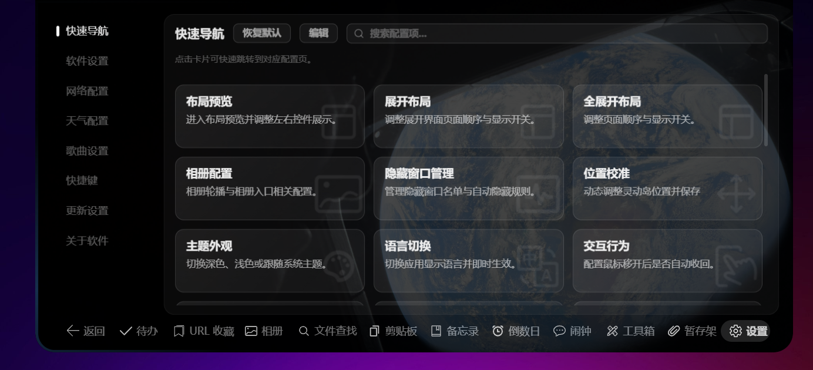
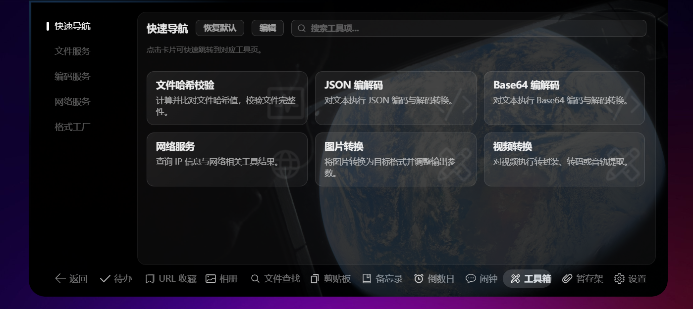

<div align="center">
  <h1>&nbsp;灵屿 Lingyu</h1>
  <p><strong>免费、开源的 Windows 桌面灵动岛</strong></p>
  <p>基于 Electron + React + TypeScript 构建，灵感来自 Apple Dynamic Island</p>
  <p>实时天气、同步歌词、音乐控制、文件暂存架、系统通知接管、音量 HUD、倒计时与系统工具</p>

  [](https://lingyu.tryworld.com.cn/)
  [](LICENSE)
  [](https://www.electronjs.org/)
  [](https://react.dev/)
  [](https://www.typescriptlang.org/)
</div>

---

> **全免费 · 无广告 · 无会员 · 无付费墙**
> 下载即用，无需安装任何环境或配置。

灵屿是一款受 Apple Dynamic Island 启发的 Windows 桌面灵动岛悬浮组件。
本项目由开源项目 [eIsland](https://github.com/JNTMTMTM/eIsland) 二次开发而来，剥离了全部收费功能与自建服务依赖，
**所有功能免费提供给大众使用**。

## ✨ 功能

| 功能 | 说明 |
| --- | --- |
| 🕐 时间/农历 | 实时时钟与农历日期 |
| 🌤 天气 | Open-Meteo 免费天气源（无需 Key） |
| 🎵 音乐 + 歌词 | 系统媒体控制（SMTC）+ 多源同步歌词 |
| ⏳ 倒计时/闹钟 | 倒计时、番茄钟、闹钟提醒 |
| 📎 文件暂存架 | Yoink 式：拖文件到岛暂存，复制取回，只存路径不复制文件 |
| 🔔 通知接管 | 系统应用通知上岛显示 |
| 🔊 音量 HUD | 调节音量时灵动岛显示音量条 |
| 🔋 电量胶囊 | 电池电量与充电状态显示 |
| 🛠 系统工具 | 音量/亮度/蓝牙/WiFi/电源/进程/性能监控/截图 |
| ⚙️ 高度可定制 | 丰富的设置中心与快捷键 |

## 🎬 宣传片

<p align="center">
  <video src="https://lingyu.tryworld.com.cn/assets/promo/lingyu-promo.mp4" poster="assets/screenshot-hover.png" controls width="90%" preload="metadata" playsinline>
    您的浏览器不支持视频播放，可前往 <a href="https://lingyu.tryworld.com.cn">官网</a> 观看。
  </video>
</p>

## 🖼 预览

<p align="center">
  
  <br/>
  <em>贴顶形态 — 灵动岛悬浮于桌面顶部</em>
</p>

<p align="center">
  
  <br/>
  <em>悬停扩展 — 悬浮显示更多信息</em>
</p>

<p align="center">
  
  <br/>
  <em>展开面板 — 音乐控制与系统信息</em>
</p>

<p align="center">
  
  <br/>
  <em>全功能界面 — 设置与系统工具</em>
</p>

## 🚀 安装

- 🌐 官网：https://lingyu.tryworld.com.cn/

1. 前往 [Releases](https://github.com/TryWorld2026/Lingyu/releases) 下载 `Lingyu-Setup.exe`
2. 双击安装，即可使用

> 提示：Windows SmartScreen 可能提示"未知发布者"，点击"更多信息 → 仍要运行"即可（免费项目暂未购买代码签名证书）。

## 🛠 开发

```bash
npm install
npm run dev        # 开发模式
npm run build      # 编译
npm run package    # 打包安装包
```

## 📄 许可证

本项目基于 [GPL-3.0-or-later](LICENSE) 发布，并附带原作者的附加条款（见 LICENSE 全文）：

- 必须保留以下署名：
  - Copyright (C) 2026-present JNTMTMTM (https://github.com/JNTMTMTM)
  - Copyright (C) 2026-present pyisland.com (https://pyisland.com)
- 本软件仅面向 Windows 平台开发，禁止移植/改编到任何 Apple 操作系统

## 🙏 致谢

- 原项目 [eIsland](https://github.com/JNTMTMTM/eIsland) 及其作者 JNTMTMTM、pyisland.com
- 天气数据：Open-Meteo（免费开源）
- 图标：iconfont
- 壁纸图片：NASA（Artemis II 任务）
