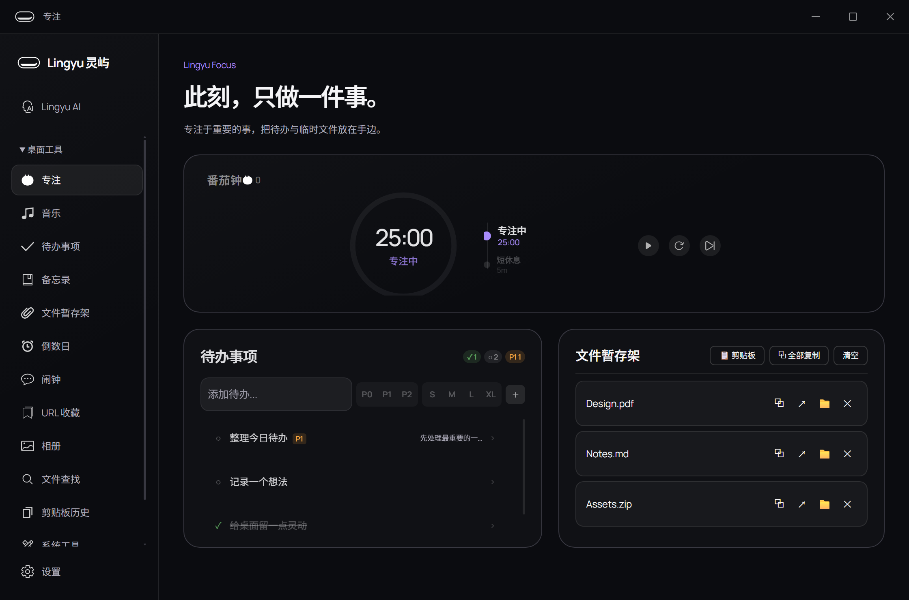

<div align="center">
  <h1>&nbsp;灵屿 Lingyu</h1>
  <p><strong>Your desktop, at your own rhythm.</strong></p>
  <p>Native preview: C# / .NET 10 / WPF · Legacy client: Electron + React + TypeScript</p>
  <p>A free open-source Windows desktop capsule and standalone workspace · Music, weather, focus, and AI</p>

  [](https://lingyu.tryworld.com.cn/)
  [](LICENSE)
  [](https://www.electronjs.org/)
  [](https://react.dev/)
  [](https://www.typescriptlang.org/)
  <br/>
  <a href="README.zh-CN.md"><strong>简体中文</strong></a>
</div>

---

> **Native preview 1.0.0-preview.6**: [Download the Windows x64 ZIP](https://github.com/TryWorld2026/Lingyu/releases/download/v1.0.0-preview.6/Lingyu-1.0.0-preview.6-win-x64.zip) · [Release notes and checksums](https://github.com/TryWorld2026/Lingyu/releases/tag/v1.0.0-preview.6) · [Native source and how to run it](native/README.md). A standalone dynamic island and workspace, now with a compact music view, its own detail panel, cover color extraction, and stoppable playback motion. Focus recovery, weather, tasks, notes, and AI chat are carried over. After unzipping, run `Open-workspace.cmd` — the .NET runtime is bundled and data is stored locally. General alarms, cross-app notifications, legacy data migration, and auto-update are not wired up yet; the [verification record](docs/NATIVE_MUSIC_ISLAND_VERIFICATION_2026-10-05.md) lists what was actually tested. The install and feature sections below still describe the legacy client v0.5.0.

> **Free · No ads · No membership · No paywall**
> Every desktop feature is free to download and use. AI can run against a local model or your own API key.

Lingyu is a lightweight desktop capsule plus a standalone workspace. Expanding the capsule shows music, real weather, the clock, and volume control; settings, AI, and the full toolset open in a resizable workspace.
This project is a second-generation development of the open-source [eIsland](https://github.com/JNTMTMTM/eIsland) by TryWorld2026, with upstream account, payment, and membership dependencies removed and the advanced capabilities restored one by one as independently usable features.
**Lingyu's software features are provided free of charge.** If you choose a cloud model, the API call fees are charged by whichever model service you pick.

## ✨ Features

| Feature | What it does |
| --- | --- |
| 🕐 Time / lunar calendar | Live clock and lunar date |
| 🌤 Weather | Open-Meteo, a free source that needs no API key |
| 🎵 Music + lyrics | System media control (SMTC) with synced lyrics from multiple sources |
| ⏳ Countdown / alarms | Countdown, Pomodoro, and alarm reminders |
| 📎 File shelf | Yoink-style: drop a file on the island to park it, copy to retrieve — stores the path, never the file |
| 🔔 Notification takeover | System app notifications appear on the island |
| 🔊 Volume HUD | The island shows a volume bar while you adjust |
| 🔋 Battery capsule | Battery level and charging state |
| 🛠 System tools | Volume / brightness / Bluetooth / WiFi / power / processes / performance / screenshot |
| ⚙️ Highly customizable | A rich settings center and keyboard shortcuts |
| 🤖 Lingyu AI | Local Ollama models or any OpenAI-compatible API with your own key; multi-turn chat, streaming replies, Markdown, and cancel — no account or membership required |

> **Which version am I reading about?** The install and feature sections below describe the legacy Electron client v0.5.0. The native preview (`native/README.md`) is a separate C# / WPF build with its own release; it does not yet include general scheduled reminders, cross-app notifications, legacy data migration, or auto-update. Use the legacy client if you need those today.

## 🤖 Free AI

Open **Workspace → Lingyu AI**, or configure a service under **Settings → AI model connection**:

1. **Local model:** start Ollama and install a model first, enter the service address (default `http://127.0.0.1:11434`), click "Save and load models", then pick a model and save.
2. **Your own key:** choose "OpenAI-compatible API", then enter a Base URL including `/v1`, the model name, and your key. Cloud endpoints must use HTTPS; a compatible service running on your own machine may use HTTP with an empty key.
3. Type a question to start chatting. Enter sends, Shift + Enter adds a line break. "Stop generating" cancels the request, and leaving the AI page also stops generation.

The key is encrypted by the main process and stored locally; the public settings never return it, and changing the service address means entering it again. Prompts ship with the app. Conversations go directly to the model service you selected and never pass through an upstream account service. The last 20 sessions stay in memory for the current run and can be switched or deleted. Closing the workspace sends it to the background while keeping the conversation and focus timers; quitting Lingyu clears them.

AI currently supports text chat and usage instructions. Automatic desktop tools, MCP, web search, and 1M-context configuration are not connected yet, and model capability depends on the service you pick. See [free feature audit](docs/LINGYU_FREE_FEATURES_AND_BRAND_2026-10-01.md) for how much of this has been restored.

## 🎬 Promo video

<p align="center">
  <a href="https://lingyu.tryworld.com.cn/#promo" target="_blank">
    
  </a>
  <br/>
  <em>👆 Click to watch the promo on the website · lingyu.tryworld.com.cn</em>
</p>

## 🖼 Preview

<p align="center">
  
  <br/>
  <em>Compact capsule — an island on your desktop, with a docked variant</em>
</p>

<p align="center">
  
  <br/>
  <em>Hover expand — floating, showing more detail</em>
</p>

<p align="center">
  
  <br/>
  <em>Expanded panel — music, real weather, time, and system volume</em>
</p>

<p align="center">
  
  <br/>
  <em>Standalone workspace — AI, focus, todos, file shelf, and full settings</em>
</p>

<p align="center">
  
</p>

See [the rebuild verification record](docs/REBUILD_VERIFICATION_2026-10-01.md) for what this round implemented and how it was checked. The screenshots are rendered by real Electron components using demo data.

## 🚀 Install

- 🌐 Website: https://lingyu.tryworld.com.cn/

1. Go to [Releases](https://github.com/TryWorld2026/Lingyu/releases) and download `Lingyu-Setup.exe`
2. Double-click to install, and you are done

> Tip: Windows SmartScreen may report an "unknown publisher". Choose "More info → Run anyway" — this free project has not purchased a code-signing certificate.
>
> **Update channel disclosure.** In-app updates fetch the metadata and the installer from GitHub Releases over HTTPS. There is no publisher signature verification: the checksum in the update metadata only proves the metadata and the installer match each other, not that either one came from this project. A failed check does not silently fall back to a third-party mirror or CDN — an alternative source can only be picked by hand. If you want the strongest assurance available, install from the Releases page above instead of the in-app updater.

## 🛠 Development

```bash
npm install
npm run dev        # development mode
npm run build      # compile
npm run package    # package the installer
```

## 📄 License

Released under [GPL-3.0-or-later](LICENSE), together with the original author's additional terms (see the full LICENSE):

- The following attribution must be retained:
  - Copyright (C) 2026-present JNTMTMTM (https://github.com/JNTMTMTM)
  - Copyright (C) 2026-present pyisland.com (https://pyisland.com)
- This software is developed for the Windows platform only; porting or adapting it to any Apple operating system is prohibited

## 🙏 Credits

- The original project [eIsland](https://github.com/JNTMTMTM/eIsland) and its authors JNTMTMTM and pyisland.com
- Weather data: Open-Meteo (free and open source)
- Icons: iconfont
- Wallpaper image: NASA (Artemis II mission)
