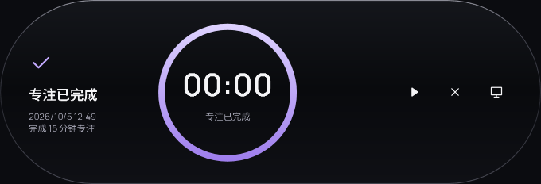
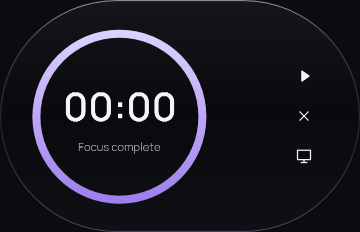
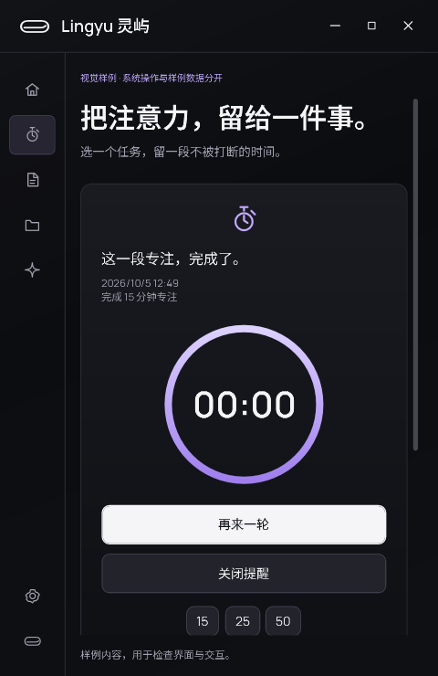

# 原生版专注恢复与完成提醒验收

日期：2026-10-05。版本：`1.0.0-preview.4`。在现有原生工作区上继续迭代，证据保存在 `dist/native-focus-review/20261005-session/`。

## 本轮行为

- 开始、暂停、继续、完成、关闭提醒和结束时，保存本轮 ID、时长、UTC 截止时间、暂停剩余时间、完成时间与确认状态。沿用隔离预览的原子 JSON，不引入第二套常驻服务。
- 运行中退出并重开，按原截止时间计算剩余时间。暂停后退出，离线期间不消耗剩余时间。计时回调只更新显示，不每秒写盘。
- 退出期间到期，下次启动保留一条待确认的完成卡片，完成时间使用原截止时间；不补播声音。运行期间到期只发出一次完成反馈，免打扰时不播放提示声。
- 完成卡片覆盖贴顶、悬停与展开态，保留到用户关闭或开始下一轮。关闭后恢复音乐或 AI 等当前有效活动，重启不会重新出现。只保留当前或最近一轮状态，没有增加历史列表。
- 到期瞬间点击暂停，会先呈现完成结果；再次选择“再来一轮”才开始新会话。显式结束会清除恢复状态。
- 专注展开态使用完整圆头胶囊、共享淡紫色圆环与简短的完成说明；按钮名称、提示和完成时间同步中英文。工作台窄窗仍可纵向滚动操作。
- 原生助手提示词同步以上能力，继续明确助手没有直接执行专注或提醒的工具。

## 复现与回归

改动前 `baseline/focus-report.json` 为 1 项通过、4 项失败：运行和暂停状态在重建会话后丢失、完成后返回音乐且状态显示错误、退出期间到期没有完成记录。样例不写用户数据的检查原本通过。

| 检查 | 结果 | 证据或命令 |
|---|---|---|
| 核心业务 | 31 项通过 | `dotnet run --project native/Lingyu.Tests -c Release` |
| 原生构建 | 0 警告、0 错误 | `dotnet build native/Lingyu.App -c Release` |
| 本地化与契约 | 186 个双语键通过 | `python native/scripts/check-contracts.py` |
| 专注与真实窗口 | 23 项通过 | `verified/focus-report.json` |
| 完整原生回归 | 52 项通过 | `full/report.json` |
| 中英文布局 | 68 项通过 | `layout/layout-report.json` |
| 打包后的独立程序 | 23 项通过 | `published/focus-report.json`，实际启动发布目录的 EXE |

专注检查包括：原子保存后的模型重建、长时间暂停、延迟回调到期、相同完成 ID 的多次恢复、关闭后连续三次重启、不逐秒写盘、结束后不恢复、到期边界点击、样例隔离，以及原生辅助功能接口触发关闭/再来一轮。

窗口检查在可见 WPF 窗口中进行：输入框保持前台焦点、草稿与选区；岛隐藏期间完成后重新显示仍保留提醒；中英文 680/480/360 DIP 专注岛与 480 DIP 工作台；完成按钮名称、提示、文字边界和圆环无重叠。原生窗口回归还覆盖既有媒体、任务、笔记、文件引用和窗口释放流程。

## 真实界面截图

以下是使用受控时间推进的实际程序窗口，属于验收样例，不是宣传图或真实个人专注统计。







## 复核命令与边界

```powershell
dotnet run --project native/Lingyu.App -c Release -- --verify-focus --showcase --output dist/focus-check --data-dir dist/focus-check-profile
```

所有窗口验收依次执行，数据目录显式隔离。`--showcase` 的虚构内容从不持久化。

本轮使用可控时钟验证“回调停止期间时间流逝”和退出后的恢复，没有让用户电脑实际睡眠或重启；物理睡眠/唤醒、多屏插拔和全部系统 DPI 仍需实机验收。隐藏/显示检查验证提醒保留，不代表重新测试了全屏检测系统接口。

应用完全退出时没有后台进程发通知，到期结果在下次启动显示。通用定时提醒、跨应用通知、休息阶段、专注历史列表、数据库迁移、自动更新和正式安装包均未在本轮交付。

## 本地预览包

独立程序位于 `dist/native-preview/1.0.0-preview.4/app/`；分发文件为 `dist/native-preview/Lingyu-1.0.0-preview.4-win-x64.zip`，同目录提供 SHA-256 校验文件。解压后双击 `Open-workspace.cmd` 打开正常模式，`Open-visual-sample.cmd` 打开带标识的视觉样例。

包内包含 .NET 运行时、双语目录、字体及第三方许可、可离线打开的验收文档与截图，以及 `verification/` 下本轮机器可读结果。它包含本轮专注改动及工作区现有的天气、媒体、原生界面改动，保留旧预览包。
