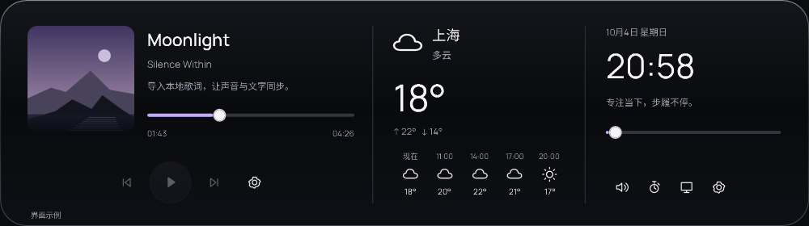
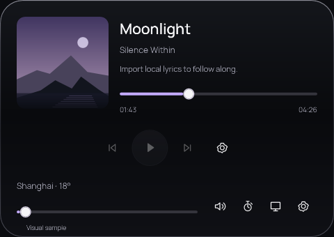

# 原生版布局与活动信息验收

日期：2026-10-04。范围：材质调整后的第二个迭代切片；在现有 WPF 客户端修复布局和状态呈现，不增加新的系统服务。

## 本轮结果

- 音乐卡片改为内容决定高度，英文播放能力说明不再被固定行高裁掉。今日页和设置页按宽度将相邻卡片移到下一行。
- 工作台最小尺寸从 900 × 600 改为 480 × 400 DIP；打开及 DPI 变化时约束到当前工作区。小于 900 DIP 时使用带提示及无障碍名称的图标导航，短窗口可以滚动导航。
- 调整窗口大小只移动现有控件。AI 输入框、键盘焦点、选区和设置草稿保留，不通过重建页面实现响应式。
- 笔记在窄窗口中将列表放到编辑器上方，标题换行；专注页将状态、圆环和动作纵向排列，内容可滚动。
- 展开岛按实际宿主宽度切换：≥ 960 DIP 三栏；760–959 DIP 音乐与时钟/快捷控制两栏，天气改为摘要；< 760 DIP 音乐与底部天气/音量/快捷入口纵向排列，高度 340 DIP。低于 480 DIP 使用 96 DIP 封面。
- 专注岛在窄屏收起左侧辅助说明，并在更窄时纵向排列动作；状态继续显示在圆环内。悬停区在极窄宽度保留播放及工作台入口。
- 固定待办在收起时使用待办图标，不再借用歌曲封面；悬停音乐区使用歌曲标题、歌手与播放动作。专注和 AI 生成仍按现有优先级呈现。本轮没有引入完整活动调度器。
- 切换语言立即刷新岛上天气及活动说明。原生提示词同步以上实际能力；复用现有翻译键，无新增未翻译产品文字。

## 可复现验证

证据目录：`dist/native-layout-review/20261004-201553/`。`source-before/` 保存改动前的工作区文件，保留了用户此前的未提交修改。

```powershell
dotnet run --project native/Lingyu.Tests -c Release
dotnet build native/Lingyu.App -c Release
python native/scripts/check-contracts.py
dotnet run --project native/Lingyu.App -c Release --no-build -- --verify-layout --showcase --output dist/layout-check --data-dir dist/layout-check/profile
dotnet run --project native/Lingyu.App -c Release --no-build -- --verify --showcase --output dist/layout-regression --data-dir dist/layout-regression/profile
```

窗口验证共用互斥锁，应依次运行。所有验证使用隔离目录，样例不写入真实用户状态。

| 检查 | 结果与证据 |
|---|---|
| 修改前布局回归 | `red/layout-report.json`：56 项中 29 项失败，覆盖固定最小宽度、英文提示重叠、小岛未随宿主缩窄及活动信息混搭 |
| 布局专项 | `final/layout-report.json`：68 项通过；中英工作台 1120 / 800 / 640 / 480 DIP，七页窄窗、480 × 400 短窗、编辑状态保留、小岛 1000 / 820 / 640 / 480 / 360 DIP 与专注岛 680 / 480 / 360 DIP |
| 业务检查 | 22 项通过，包括原生提示词对布局与固定待办行为的同步 |
| Release 构建 | 0 警告、0 错误 |
| 双语与资源契约 | 175 个双语键、静态产品文案、资源与旧版提示词边界检查通过 |
| 独立 AI 协议检查 | `ai-final/ai-report.json`：11 项通过，使用本地 HTTP 协议夹具，不是真实模型验收 |
| 完整交互与释放检查 | `regression-final/report.json`：52 项通过，包含原生边框/鼠标悬停、专注状态切换、笔记保存、文件引用、本地 AI 协议与 100 次工作台开关后的释放 |

完整回归曾发现一处检查器误报：实际截图已有完整 Ollama 夹具回复，但检查器读取 `TextBlock.Text`，漏掉了 Markdown 的 `Run` / `Span` 内容。改用原生 `TextRange` 读取实际文本范围后，独立协议检查通过。保留了 `ai-diagnostic/` 截图与文本记录，没有因此修改 AI 生成逻辑。

## 窗口截图

这些图来自可运行的原生界面；封面、歌曲和天气属于明确标记的样例。样例的播放按钮保持禁用。





- `final/today-en-US-480.png`：能力说明完整，卡片上下排列。
- `final/notes-en-US-480.png`：笔记列表和编辑器纵向排列，英文标题完整换行。
- `final/ai-en-US-480x400.png`：短窗口中编辑状态及操作入口保留。
- `final/docked-zh-CN.png`、`final/hover-zh-CN.png`：固定待办与音乐活动分别呈现。
- `final/desktop-island-*.png`：实际桌面合成截图，用于确认原生窗口轮廓与命中区域；不能用 WPF 离屏截图替代这些证据。

## 动画诊断与边界

环境为当前 Windows 11、150% 系统缩放（144 DPI）、软件渲染。`motion/animation-report.json` 记录 36 次切换：WPF 回调 P95 34.08 ms，最大 45.18 ms，收敛 P95 233.28 ms；进程 Private Bytes 59.84 → 63.28 MiB；切换期间整机口径 CPU 5.32%，静止后解除逐帧订阅。该结果与前一材质切片的约 33.7 ms 回调处于相近范围，不能宣称实际呈现达到 60 fps。

本轮通过改变窗口 DIP 尺寸验证窄宽布局，没有修改系统缩放。100% / 125% / 200%、混合 DPI 多屏迁移、浅色桌面、真实播放器长标题/歌词/封面以及真实模型仍需独立实测。本轮不构建发布包、不覆盖旧安装或旧数据。

下一切片优先完成真实媒体兼容与动态内容压力验证，再继续可靠专注会话、提醒和活动调度。
