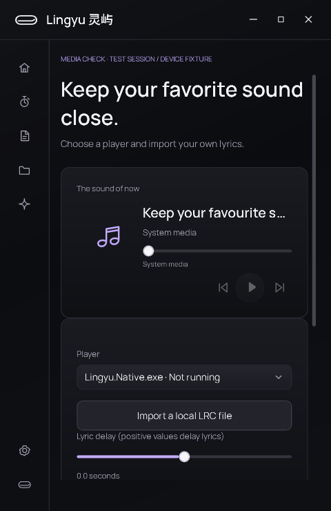

# 原生版媒体与音频设备验收

日期：2026-10-05。本轮在现有原生工作区继续迭代默认音频设备生命周期、播放器退出/恢复状态，以及播放器选择框的视觉与操作。证据目录为 `dist/native-media-review/20261005-session/`。

## 已实现

- 音量服务订阅 Core Audio 设备通知。Windows 默认多媒体输出变化时，解绑旧端点，再读取新端点的音量与静音；不修改系统默认设备。
- 设备通知转到创建服务的界面线程处理，并合并连续通知。回调内不等待、不释放 COM 对象；旧端点的迟到音量通知失效。
- 没有输出或端点读取/控制失败时清除可用状态，小岛的音量滑杆与静音按钮一起禁用；设备恢复时重新绑定。
- 音量滑杆正在捕获鼠标时，系统音量更新也只同步显示，不把绑定更新误当成用户操作再次写回。
- 手动选择的播放器退出后，工作台和小岛菜单保留原选择并显示“未运行”。播放器重新出现后移除该提示，用户也能主动切回“跟随系统播放器”。
- 播放器下拉框使用共享深色表面、淡紫色选中/焦点状态；保留原生 ComboBox 选择、弹出和辅助功能接口。中英文文案与原生助手能力说明同步。

没有增加驻留辅助进程或轮询计时器。端点与枚举器均在服务释放时解除订阅；窗口仍共享应用级会话。

## 复现证据

`baseline/media-report.json` 的 9 项检查中有 6 项失败，分别为：切换后仍读取旧设备、设备断开后仍可控制、旧通知仍被发布、读取失败仍显示可用、实际滑杆没有禁用、播放器选择框与后台选择不一致。

后续实窗检查又捕获并修复：

- `selector-reconnect/`：播放器返回后“未运行”提示残留。
- `mute-red/`：无设备时静音按钮仍可操作。
- `capture-red/`：滑杆捕获鼠标期间，绑定更新触发系统音量回写。
- `menu-red/`：小岛播放器菜单遗漏已退出的固定播放器。

初始 `red/` 报告受到托管夹具清理错误影响，不作为设备修复依据。最终夹具在私有构造路径注入 COM 接口响应，业务仍执行真实 `VolumeService`；没有给产品增加测试专用公开接口。`source-before/` 保存本轮开始时的工作区文件，差异另存于 `media-only.diff`，保留此前未提交工作。

## 验证方式与结果

```powershell
dotnet run --project native/Lingyu.Tests -c Release
dotnet build native/Lingyu.App -c Release
python native/scripts/check-contracts.py
dotnet run --project native/Lingyu.App -c Release --no-build -- --verify-media --showcase --output dist/media-check --data-dir dist/media-check/profile
dotnet run --project native/Lingyu.App -c Release --no-build -- --verify-layout --showcase --output dist/media-layout --data-dir dist/media-layout/profile
dotnet run --project native/Lingyu.App -c Release --no-build -- --verify --showcase --output dist/media-full --data-dir dist/media-full/profile
```

窗口验证依次执行。媒体专项会暂时展示明确标记的测试窗口，在当前进程自己的窗口上发布一个无声音的 SMTC 测试会话，只向这个明确识别的测试会话发送控制命令；不控制原有播放器，不切换真实默认设备，不调整真实系统音量。

| 检查 | 结果 |
|---|---|
| 媒体/音频专项 | `styled/media-report.json`：12 项通过；`smtcVerified=true` |
| 业务与原生提示词 | 24 项通过 |
| Release 构建 | 0 警告、0 错误 |
| 双语、资源及旧版提示词边界 | 182 个双语键及其余契约检查通过 |
| 完整交互与窗口释放 | `full/report.json`：52 项通过，包含 100 次工作台开关后的释放检查 |
| 中英文布局回归 | `layout/layout-report.json`：68 项通过 |

受控 COM 检查覆盖默认设备替换、无设备/恢复、忽略其他用途的默认设备事件、后台线程连续通知、旧通知失效、读取失败、关闭后的排队回调，以及实际小岛滑杆和按钮绑定。

SMTC 检查经过 Windows 系统媒体接口：发布测试歌曲、按来源标识选择、接收播放命令、回传播放状态、撤销会话清空歌曲与控制能力、重新发布恢复原选择。中英文工作台还验证了下拉框展开、键盘焦点和通过辅助功能接口切回自动选择。截图中的播放数据来自这个测试会话，不代表真实歌曲播放。

## 实际窗口




中文工作台、连接状态与小岛设备恢复截图也保存在 `styled/`。截图由实际 WPF 控件渲染，未使用宣传图替代。

## 实测范围

本机仅检测到一个播放输出端点，因此物理扬声器/耳机切换尚未实测，报告保留 `physicalDeviceSwitchVerified=false`。真实输出设备的连接与读取通过；设备替换和断开由受控 COM 边界重放验证。

SMTC 系统链路通过不等于所有第三方播放器均已验证。网易云、Spotify、浏览器等各自提供的时间轴、跳转、封面与歌词能力仍需要逐个实际测试；本轮没有加入专有播放器适配器。未切换系统 DPI，未覆盖蓝牙重连、睡眠恢复或音频服务重启。

下一阶段优先补专注会话恢复与提醒闭环，再继续扩展播放器兼容矩阵和真实硬件切换验收。

## 接口依据

- [IMMNotificationClient 的回调与释放约束](https://learn.microsoft.com/en-us/windows/win32/api/mmdeviceapi/nn-mmdeviceapi-immnotificationclient)：设备回调必须及时返回，不在回调内注销通知或释放最后一个设备引用。
- [默认设备变化的用途和空设备标识](https://learn.microsoft.com/en-us/windows/win32/api/mmdeviceapi/nf-mmdeviceapi-immnotificationclient-ondefaultdevicechanged)：本轮跟随播放方向的多媒体用途，空默认设备按不可用处理。
- [音量回调约束](https://learn.microsoft.com/en-us/windows/win32/api/endpointvolume/nn-endpointvolume-iaudioendpointvolumecallback)：音量通知同样转发到服务所属线程后发布。
- [为本进程窗口取得 SMTC](https://learn.microsoft.com/en-us/windows/win32/api/systemmediatransportcontrolsinterop/nf-systemmediatransportcontrolsinterop-isystemmediatransportcontrolsinterop-getforwindow)：验收使用自己创建的窗口发布测试会话。
