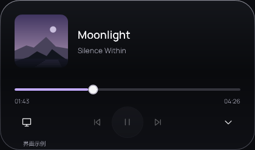
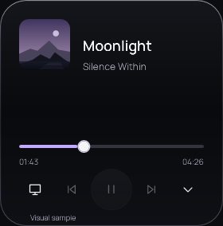
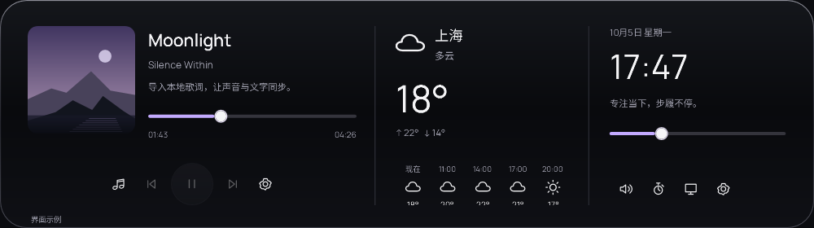

# 原生音乐小岛 · preview.5 验收

执行日期：2026-10-05。基线为 `d80ba1e` / `1.0.0-preview.4`；实现版本为 `1.0.0-preview.5`。这是独立原生预览，不代表旧客户端全部功能已迁移。

## 本轮实现

音乐路径为紧凑态 → 悬停 → 独立音乐详情 → 总览／工作台 → 收起。无主活动时为 64 × 40 DIP 标志；音乐紧凑态为 192 × 44，悬停为 340 × 64，详情为 420 × 248。详情在 280–359 DIP 可用宽度下重排为 284 DIP 高。总览保留三栏和原窄窗布局，所有形态复用同一个 HWND 与封面实例。

暂停保留 60 秒，重复暂停事件不续期；继续播放取消到期，移除会话清空封面。固定任务、专注、AI 和手动展开不被空闲收敛覆盖。两个音乐滑杆分别保护自己的拖动值，异步跳转结束后恢复绑定；专注完成在释放后呈现。

封面后台解码并采样为 16 × 16 BGRA，图像和强调色一起提交；旧请求和关闭后的结果被忽略。同一封面引用不重新解码。缺失、透明、纯黑白和坏图回退为紫色。颜色仅作用于音乐进度与五条播放状态柱，不修改全局主题。

五条柱是播放状态动效，不是实时频谱，不读取麦克风或系统音频。使用一个 34ms 计时器，暂停、隐藏、非紧凑音乐、减少动效或卸载时停止，卸载解除 Tick 订阅。颜色过渡结束解除动画时钟。NativePrompt 和双语文本同步说明这些边界。

## 实窗

以下是运行中的 WPF 原生界面，示例数据有明确标记；没有重绘产品截图。








## 检查结果

| 检查 | 结果 |
|---|---|
| Core | 38 项通过，包括暂停期限、取色、双内容反向运动和双语提示词 |
| Release 构建 | 0 警告、0 错误 |
| 契约 | 192 个双语键、资源与旧客户端提示词边界通过 |
| 音乐实窗 | 21 项通过：原生命中穿透、缺失控制能力、取色乱序、坏图、两条滑杆、专注保护、暂停到期、长文本、播放动效与关闭释放 |
| 布局 | 76 项通过，包含两种语言的 420／360／320／280 DIP 音乐详情与原总览、工作台检查 |
| 媒体 | 13 项通过，含经过 Windows 的受控 SMTC 会话及默认输出设备夹具 |
| 专注 | 23 项通过 |
| 天气 | 12 项受控响应检查通过 |
| 完整窗口 | 52 项通过，包含原生裁切、输入焦点、任务／笔记／文件、AI 协议与工作台释放 |

音乐用例最初因不存在详情和播放动效失败，再经实现通过。全部窗口进程依次运行。媒体夹具没有更改真实系统音量、默认设备或外部播放器的播放状态。

实际光标录像覆盖短暂扫过取消悬停、悬停控制、点击展开、离开保持、切换总览、窗口外释放滑杆、五次快速反向、暂停和空状态。浅色与深色测试背景均经过桌面合成采集。窗口 DC 采集在原生区域变化时会残留旧区域，故评审采用桌面区域录像 `recording-composed/music-interactions.mp4`，不把前一次 DC 采集当作真实呈现。

## 环境、性能与覆盖限制

Windows 11 专业工作站版，build 26200；i5-13500H，16 逻辑处理器；.NET SDK 10.0.302；默认软件渲染；本机实际 150% 缩放（144 DPI）。100%、125%、200%、混合 DPI 多显示器和物理睡眠恢复未在本轮实测；窗口改宽及模拟时钟不替代这些覆盖。

不强制 GC 的独立场景采样：每场景预热 5 秒，再采 3 个 3 秒区间。测试进程保留隔离模型和隐藏的验收宿主，数据不代表所有机器。

| 场景 | Private Bytes | 平均整机 CPU |
|---|---|---|
| 空闲标志 | 64.01–64.24 MiB | 0.40% |
| 紧凑播放动效 | 62.69–70.32 MiB | 0.22% |
| 音乐详情 | 70.88–72.57 MiB | 0.97% |
| 音乐工作台 | 76.19–91.25 MiB | 0.24% |

详情有一个 2.01% CPU 样本；空闲有一个 0.78% 样本。保留这些波动，不用平均数宣称持续零占用。100 次岛窗口关闭后，窗口与播放柱的弱引用均释放；资源先测量，随后仅为诊断持有关系执行 GC。工作台的 100 次开关也通过释放检查。短时采样不能证明长期无泄漏。

形变分别运行音乐详情和总览各 36 次。WPF 回调 P95 为 32.68ms / 37.55ms，总体 34.59ms；同环境旧预览基线为 38.28ms。静止后释放 Rendering 订阅。**默认软件路径仍未达到 20ms 的回调 P95 目标，不能宣称屏幕实际达到 60fps。** 录像仅用于视觉和交互检查，没有把编码帧率当作呈现性能。

真实播放器只读观察：本机 `msedgewebview2.exe` 会话声明播放、跳转与时间轴可用，前后曲与封面不可用；没有向该外部会话发送控制命令。受控 SMTC 会话验证了实际发现、播放请求、状态变化、退出和返回。网易云、QQ 音乐、Spotify、其他浏览器和物理音频设备切换仍未在本轮验证。

## 重跑与证据

工作区原始结果在 `dist/native-music-review/preview5/`：`baseline/`、`music/`、`layout/`、`media/`、`focus/`、`weather/`、`full/`、`animation/`、`resources/` 与 `recording-composed/`。原始文件不进入 Git；上方选定截图随仓库与预览包保存。

```powershell
dotnet run --project native/Lingyu.Tests -c Release
dotnet build native/Lingyu.App -c Release --nologo
python native/scripts/check-contracts.py
dotnet run --project native/Lingyu.App -c Release --no-build -- --verify-music-island --showcase --output dist/music-check --data-dir dist/music-check-data
```

其他独立入口：`--verify-layout`、`--verify-media`、`--verify-focus`、`--verify-weather`、`--verify-animation`、`--verify`。音乐入口追加 `--measure-music` 可复查资源，追加 `--record-music` 可配合外部桌面区域录屏。一次只运行一个窗口验收进程。

包包含 .NET 运行时、本地字体及许可，继续使用 `%LOCALAPPDATA%/Lingyu/NativePreview`。正常状态不保存样例。预览 ZIP、SHA-256、独立解压启动和网站发布结果以本版本发行说明为准；稳定旧版安装包继续保持 `v0.4.1`。


## 发布复核

2026-10-05 已发布 [v1.0.0-preview.5](https://github.com/TryWorld2026/Lingyu/releases/tag/v1.0.0-preview.5)，类型为 prerelease；GitHub Latest 稳定版保持 v0.4.1。

- 构建源码：`af84c731d9c2c06cc329ecd9953de60dc9a39c9b`。最终 EXE 的 ProductVersion 包含同一提交；[Windows CI](https://github.com/TryWorld2026/Lingyu/actions/runs/37295720451) 通过。
- ZIP：`Lingyu-1.0.0-preview.5-win-x64.zip`，96,912,250 bytes。
- SHA-256：`0ac9fc2453bff001309412339059b46b9dcdf44db389ee8ff10bcd2e54404b23`。GitHub 资产 digest 与公开下载的 `.sha256` 均一致。
- 从最终 ZIP 独立解压后，音乐 21 项、布局 76 项、完整窗口 52 项及专注 23 项检查全部通过。包内两种语言、运行时、字体许可与四个内嵌 TTF 均已核实。
- [官网](https://lingyu.tryworld.com.cn) 更新到 preview.5，使用最终包生成的双语实际界面；保留旧安装包入口。官网提交 `e0023a57654b4d848f308391a88f4c0dcb744989`，[Cloudflare Pages 部署](https://github.com/TryWorld2026/lingyu-website/actions/runs/37299291282) 成功。

最终包结果在 `final-music/`、`final-layout/`、`final-full/`、`final-focus/` 与 `release-verification.json`。官网本地检查覆盖中英文 1440／390 像素、形态切换、图片放大、下载通道、语言切换和非法发行元数据回退；每组通过。悬停图从最终包的物理窗口画面裁切，其余产品图只包含程序视觉树，不发布桌面背景或其他应用内容。
