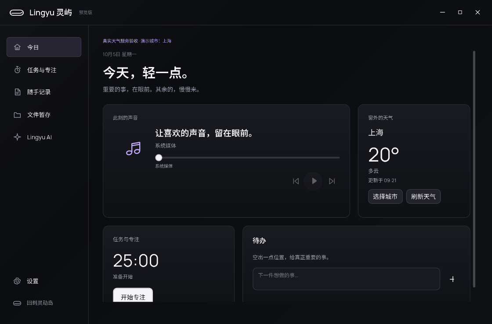

# 原生版天气一致性验收

验收日期：2026-10-05。本轮继续现有原生版，修复天气切城、缓存刷新和异步请求一致性，并补齐加载、失败、更新时间与手动刷新入口。

## 已实现行为

- 切换城市立即显示新城市，并清空旧城市的温度、高低温和预报。失败后显示不可用，不把旧城市天气放到新城市名下。
- 每次请求绑定城市和请求代次。新选择取消之前的请求；即使传输仍交回迟到结果，该结果也不能覆盖当前城市或发布状态。应用退出后的响应不再更新会话。
- 解析整份响应成功后才替换缓存。字段缺失、错误时间、数组不一致等异常保持原有有效缓存，不留下半份新数据。
- 显示天气的今日页、设置页或展开音乐岛持有刷新需求；30 分钟缓存到期后由既有计时回调触发刷新，不新增常驻计时器。关闭、隐藏、最小化或离开对应页面后释放需求；恢复显示时检查缓存。
- 同一时刻只请求一次；失败后自动请求退避 1 分钟。手动刷新可以立即重试，请求期间按钮禁用。
- 同城刷新失败保留上次有效天气，并显示缓存时间与失败说明。当天显示时间；跨日显示日期和时间；提示可读到完整更新时间。
- 今日页和设置页新增刷新按钮，展开岛增加更新时间/失败提示。中英文目录同步，原生助手提示词同步实际能力。
- 展示样例仍保持明确标记，不请求或保存虚构天气。

## 复现与验证

证据目录：`dist/native-weather-review/20261004-233441/`。本轮从 10 月 4 日开始，10 月 5 日完成验收。`source-before/` 保存改动前已有工作区内容；`weather-only.diff` 用于比较本轮改动，不覆盖此前未提交的工作。

修改前的三个原有探针均失败：切城后旧数据残留、迟到响应覆盖新城市、缓存到期不刷新。扩展后的 `red/weather-report.json` 共 7 项，6 项失败，额外覆盖重复刷新、异常响应和退出后的迟到更新。新增最小化探针也复现了错误：WPF 的可见性值不能单独代表窗口正在显示，补上窗口状态订阅后通过。

```powershell
dotnet run --project native/Lingyu.Tests -c Release
dotnet build native/Lingyu.App -c Release
python native/scripts/check-contracts.py
dotnet run --project native/Lingyu.App -c Release --no-build -- --verify-weather --showcase --output dist/weather-check --data-dir dist/weather-check/profile
dotnet run --project native/Lingyu.App -c Release --no-build -- --verify-weather --showcase --live-weather --output dist/weather-live-check --data-dir dist/weather-live-check/profile
```

窗口验证应依次运行。默认天气检查使用受控响应；`--live-weather` 额外读取一次真实 Open-Meteo 服务，并在隔离配置中使用明确标记的上海演示城市，不读取用户位置或覆盖原有城市设置。

| 检查 | 结果 |
|---|---|
| 天气专项 | `verified/weather-report.json`：13 项通过，包含 12 项受控请求/实际窗口检查与 1 项真实服务读取和原生显示；`liveWeatherVerified=true` |
| 原生业务与提示词 | 23 项通过 |
| Release 构建 | 0 警告、0 错误 |
| 双语和资源契约 | 180 个双语键及产品文案、资源、旧版提示词边界检查通过 |
| 布局回归 | `layout-regression/layout-report.json`：68 项通过 |
| 完整交互与关闭释放 | `full-final/report.json`：52 项通过，包含真实控件操作、AI 协议受控响应与 100 次窗口开关后的释放检查 |

首次完整回归中，悬停尺寸与悬停边缘两项检查失败，其余 50 项通过。保持悬停实现与检查不变，单独复测 `frame-recheck/report.json` 的 21 项通过，再次完整回归的 52 项全部通过。尚未确认首次失败的原因，保留原始失败报告；这次通过不能替代长期悬停稳定性观察。

受控请求检查覆盖：切城加载/失败、请求乱序、有效缓存、缓存到期、窗口最小化/恢复、小岛收起/展开/隐藏、重复回调、解析失败、会话退出、失败退避、手动恢复以及中英文可见状态。测试传输故意允许迟到响应，用于验证结果代次保护。

## 实际界面



这张图使用真实服务返回的数据，上海是验收选择的演示城市；截图中的天气只代表该次请求，不是持续实时播报。

- `verified/weather-stale-zh-CN.png`：同城失败保留缓存，并明确显示原数据时间。
- `verified/weather-loading-zh-CN.png`、`verified/weather-loading-en-US.png`：加载时新城市与空温度一致，刷新按钮禁用。
- `verified/weather-offline-*.png`、`verified/weather-island-offline-*.png`：失败后没有旧温度或旧预报，文案正常换行。

## 范围与后续

本轮复用了原有天气服务地址、JSON 配置和 WPF 主题；异步状态只保存数据，不让会话服务持有关闭窗口。界面按原有页面生命周期释放订阅。天气缓存仍只在当前进程内，不新增跨重启缓存或位置自动识别。

真实服务仅在当前机器、上海演示城市做了一次端到端核实；不同城市/时区、长期断网、休眠及系统时钟调整需要继续实测。系统缩放仍为当前 150%，其他 DPI 与混合缩放多屏不在本轮通过范围内。

下一轮继续真实播放器兼容、默认音频设备切换，以及专注会话与提醒的可靠性。
